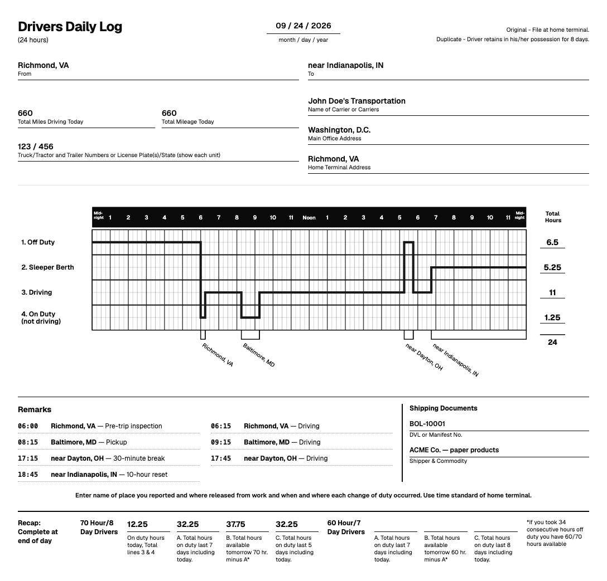

# ELD Trip Planner — Web

The React frontend for planning a property-carrying truck trip. Drivers enter a current location, pickup, drop-off, and hours already used in the current 70-hour cycle. The app presents the route, required stops, trip summary, and a printable Driver's Daily Log for each day. The [API repository](https://github.com/jearzaga/eld-trip-planner-api) owns routing, hours-of-service calculations, and saved trip data; this frontend renders its response.

| Deliverable | Link or status |
|---|---|
| Live web app | Pending Vercel project setup |
| API repository | [eld-trip-planner-api](https://github.com/jearzaga/eld-trip-planner-api) |
| Demo video | Pending live deployment and final recording |



The image is an automated visual reference using a deterministic web mock. The live API contract and canonical response fixtures will replace the temporary mocks after API phase A5.

## Stack

React 19, Vite, TypeScript, Tailwind CSS, shadcn/ui, React Router, TanStack Query, Zustand, React Hook Form with Zod, Leaflet, and Axios. Testing uses Vitest, React Testing Library, MSW, and Playwright on desktop and mobile. The app is designed for a static Vercel deployment.

## Run locally

Use Node 22 or 24. Check out the API repository as `../eld-trip-planner-api` and follow its README to configure its local `.env` and MongoDB connection.

```bash
npm ci
cp .env.example .env.local
npm run dev
```

The web app opens at `http://localhost:5173`. `.env.example` points `VITE_API_BASE_URL` to `http://localhost:8000/api`. Start the sibling API when using the app outside Playwright. The frontend never calculates HOS totals or stop timing.

## Verify changes

```bash
npm run test:run
npm run typecheck
npm run lint
npm run build
npm run e2e
```

Playwright starts the sibling API with `GEO_PROVIDER=fake` and starts Vite. It needs the API repository's local database configuration. Current web acceptance specs intercept trip and geocode requests with deterministic contract-shaped responses; the direct API contract spec stays skipped until A5 publishes the real endpoints and fixtures. If another Vite server uses port 5173, run `E2E_PORT=5174 npm run e2e`.

After A5 publishes `openapi.yaml` and `tests/fixtures/responses/*.json`, run `npm run sync-contract` to generate web types and copy the canonical fixtures. Commit the generated artifacts with the API commit SHA. Do not edit `src/lib/api/schema.d.ts` by hand.

The production smoke test is reserved for W10 after both deployments and the live API are ready:

```bash
E2E_BASE_URL=https://<web-app>.vercel.app E2E_API_URL=https://<api-app>.onrender.com/api npm run e2e -- --project=smoke
```

The Render free tier may take about a minute to wake after inactivity. The planner shows a wake message after three seconds, keeps the form usable, uses a 90-second request timeout, and retries a transient plan failure once.

## Project documents

- [Definition of done](docs/01-definition-of-done.md)
- [Architecture](docs/02-architecture.md)
- [Implementation plan and progress](docs/03-implementation-plan.md)
- [Testing strategy](docs/04-testing-strategy.md)
- [Release and demo checklist](docs/07-release-checklist.md)
- [Canonical HOS business rules](https://github.com/jearzaga/eld-trip-planner-api/blob/main/docs/01-business-rules.md)
