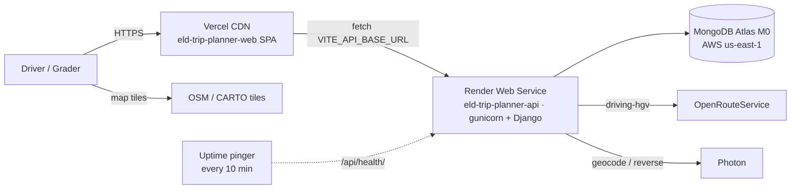

# 02 — Architecture (system + web)

> Backend internals, the HOS engine, the data model and the **API contract** are documented in
> `eld-trip-planner-api/docs/02-architecture.md`, which is the source of truth for the contract.

## 1. Repository strategy

| Repo | Owns | Deploys to | Local checks |
|---|---|---|---|
| `eld-trip-planner-api` | HOS rules + engine, log builder, geo adapters, REST API, MongoDB models, **API contract** (`openapi.yaml`, scenario response fixtures), canonical business rules | **Render** (Web Service, gunicorn) | `uv run ruff check . && uv run pytest` (incl. contract drift tests) |
| `eld-trip-planner-web` | UI, log-sheet rendering, **system E2E (Playwright)**, product Definition of Done | **Vercel** (static SPA) | `npm run lint && npm run typecheck && npm run test:run && npm run check-contract && npm run e2e` |

**Why two repos:** separate deploy targets and lifecycles, a clear ownership boundary (rules and data vs presentation),
and each repo stays small enough for a grader to review on its own.

**What it costs, and how we pay for it:**

| Cost of splitting | Mitigation |
|---|---|
| API and UI can drift apart | API commits `openapi.yaml` + scenario response fixtures; web generates types from them (`npm run sync-contract`); consumer-side `api-contract.spec.ts` in Playwright |
| E2E needs both apps | Playwright `webServer` boots the sibling API (`API_DIR`); `full-system.spec.ts` plans a trip through it with no mocks |
| Docs split across repos | Each doc has one canonical home (rules → api, DoD → web); others link, never copy |
| A change can span both repos | Local sibling folders + `claude --add-dir`; API commits tagged `contract:` / `BREAKING:` |

## 2. System context & deployment topology



| Concern | Setting |
|---|---|
| Web → API base URL | `VITE_API_BASE_URL=https://<api>.onrender.com/api` (Vercel env, per environment) |
| CORS | API allows `https://<app>.vercel.app` + preview regex `^https://eld-trip-planner-web-.*\.vercel\.app$` |
| SPA routing | `vercel.json`: `{"rewrites":[{"source":"/(.*)","destination":"/index.html"}]}` |
| Region | Render `virginia` + Atlas `us-east-1` (close together; graders likely in the US) |
| Secrets | Only in the Render/Vercel dashboards; never in either repo |

## 3. Cold-start UX (Render free tier) — AC-46

Render free web services sleep after 15 idle minutes and take about a minute to wake up. The web app treats this as a normal state:

1. On app load, `useServerStatus()` fires `GET /api/health/` (timeout 90 s).
2. If there's no answer within 3 s, a non-blocking banner shows "Waking up the server — about a minute on the free tier". The form stays usable.
3. **Plan trip** waits for health (or sends anyway, with a 90 s timeout) and retries once on 502/503/network errors.
4. The loader shows staged messages: "Waking server…" → "Routing…" → "Applying HOS rules…" → "Drawing logs…".
5. Ops: an uptime pinger during the grading window, and/or Render Starter plan for that week.

## 4. Frontend architecture

**Stack:** Vite + React + TypeScript · Tailwind v4 + shadcn/ui · TanStack Query (server state) · Zustand (client UI state) ·
axios (HTTP) · react-router · react-hook-form + zod · react-leaflet · date-fns + @date-fns/tz · openapi-typescript
(generated types) · Vitest + RTL + MSW · Playwright + @axe-core/playwright. Install steps: `06-project-setup.md`.

```
src/
├─ app/            # router, QueryClientProvider, theme tokens (duty-status colors shared everywhere)
├─ pages/          # PlannerPage "/", TripPage "/trips/:id", NotFound
├─ features/
│  ├─ server-status/  # useServerStatus, WakeBanner
│  ├─ trip-form/      # TripForm, LocationAutocomplete, CycleInput, LogDetailsSection, schema.ts
│  ├─ summary/        # SummaryCards
│  ├─ route-map/      # RouteMap, StopMarker, MapLegend
│  ├─ stops/          # StopsTimeline
│  └─ log-sheets/     # LogSheet, LogHeader, LogGrid, Remarks, Recap, LogSheetPager, print.css
├─ components/ui/  # shadcn primitives
├─ stores/         # ui-store.ts (Zustand: selected stop, active log day)
├─ lib/api/        # client.ts (axios: base URL, 90 s timeout, error normalization), schema.d.ts (generated), hooks.ts
└─ test/           # setup.ts, handlers.ts (MSW, serves synced fixtures), fixtures/
```

**Data flow:** `TripForm` → `usePlanTrip` (POST) → navigate `/trips/:id` → `useTrip` (GET) → `SummaryCards`, `RouteMap`,
`StopsTimeline`, `LogSheetPager` → `LogSheet` × N.

**Layout:** desktop has the form panel (≈400 px) on the left and the map on the right, with results below (summary →
timeline → log sheets). Mobile stacks everything vertically.

### 4.1 Log sheet rendering (the highest-value visual)

`LogSheet` is a **pure SVG component** that takes one `daily_log` from the API. It mirrors the company template:

| Region | Content (from API) |
|---|---|
| Title | "Drivers Daily Log (24 hours)" · date as month / day / year · Original/Duplicate note |
| From / To | `header.from`, `header.to` |
| Boxes | Total Miles Driving Today · Total Mileage Today · Truck/Tractor and Trailer Numbers |
| Right column | Name of Carrier · Main Office Address · Home Terminal Address |
| Grid | Header bar "Mid-night 1 … 11 Noon 1 … 11 Mid-night" · rows 1 Off Duty, 2 Sleeper Berth, 3 Driving, 4 On Duty (not driving) · 15-min ticks · "Total Hours" column |
| Duty line | One `<path>`: `x = gridLeft + (min / 1440) * gridWidth`, y = row center; vertical joins at status changes |
| Remarks | Bracket under the grid for each remark + angled "City, ST" label; list with time and note |
| Shipping docs | DVL / Manifest No. or Shipper & Commodity |
| Recap | 70 Hour / 8 Day: on-duty today, A, B, C; 34-hour restart note |

The sheet prints one per page (`@page { size: letter landscape }`), and the SVG scales to container width on mobile.

## 5. Environment variables (web)

| Var | Local | Vercel |
|---|---|---|
| `VITE_API_BASE_URL` | `http://localhost:8000/api` | `https://<api>.onrender.com/api` |
| `API_DIR` (E2E only) | `../eld-trip-planner-api` | — |
| `E2E_BASE_URL` (smoke) | — | `https://<app>.vercel.app` |
| `E2E_API_URL` (smoke) | — | `https://<api>.onrender.com/api` |

## 6. Risks

| Risk | Mitigation |
|---|---|
| Contract drift | Generated types + synced fixtures + `api-contract.spec.ts`; `npm run check-contract` before each PR fails when the synced contract is stale |
| Cold start makes the app look broken | §3 (AC-46) + `cold-start.spec.ts` |
| Leaflet SSR/CSS issues | Import `leaflet/dist/leaflet.css`; fix default marker icon paths; custom SVG markers |
| Log sheet illegible on mobile | Horizontal fit with pinch/zoom hint + "open full size" / print |
| Visual regressions | Playwright `toHaveScreenshot` on the SC-2 Day 1 sheet |
